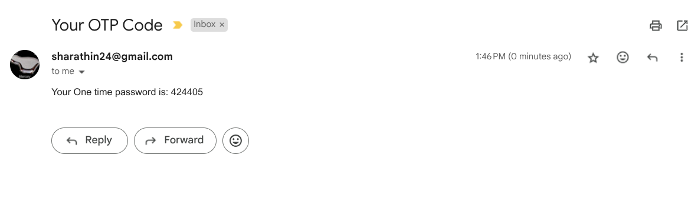
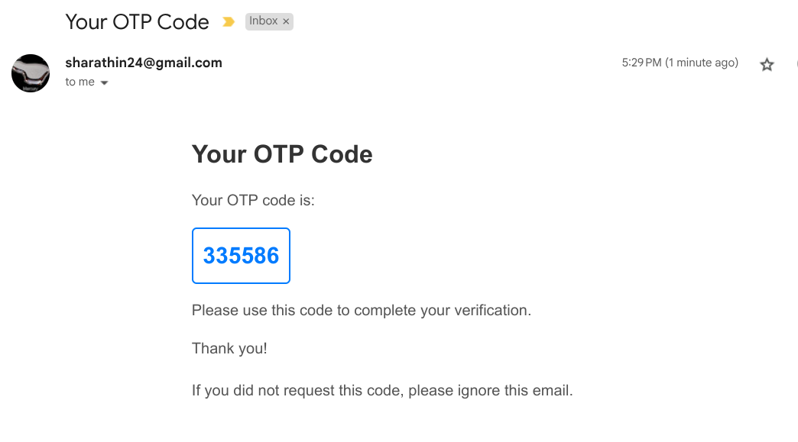

If user exists then show USER_FOUND error message:

> if we dont do this, then api will show lots of information to normal user

---

update error message:

---

login route

invalid:

> add invalid user in postman/thunderclient, to see invalid email id error

success:

---

register user
- front end code check

---
update Login with backend 

if you pass incorrect data you should get following errors:

---
send otp to user

success:

email success:

stylish otp:

---
verifying otp:

invalid otp:

expired otp:

---
change password:

